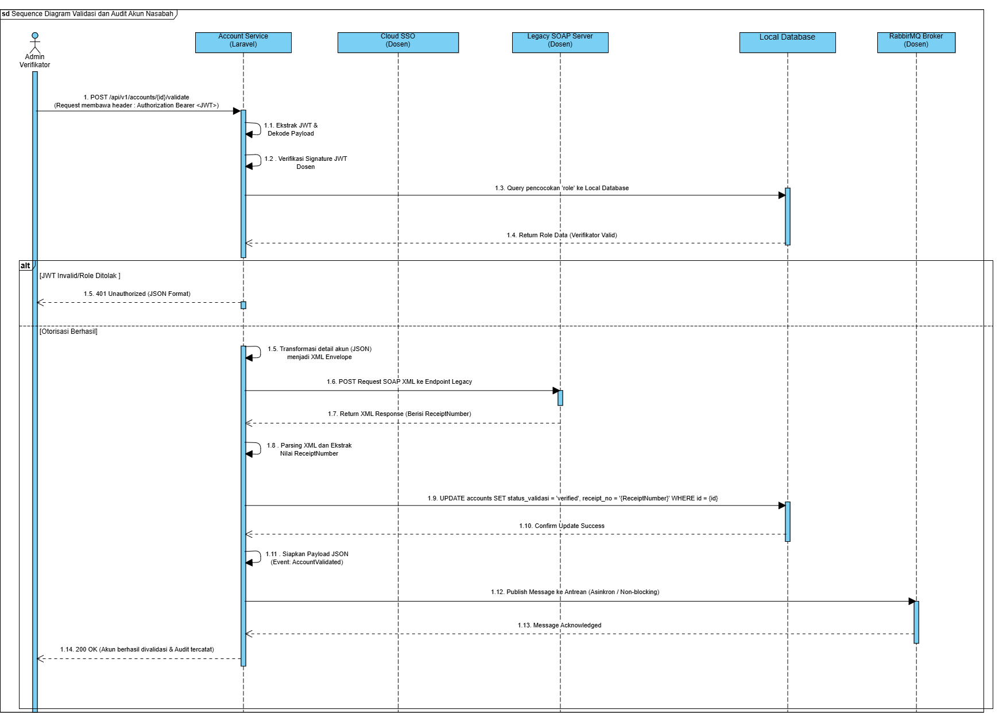

# Analisis Tugas 3 - Integrasi Aplikasi Enterprise
**Layanan Utama:** Account-Service (Service 1 - Kelola Akun)

**Tema Ekosistem:** Pengajuan Pinjaman Nasabah Berbasis Riwayat Transaksi Fintech

---

## 1. Justifikasi Transaksi Kritis (State-Changing)

Dalam arsitektur *Fintech Digital* kelompok kami, **Account-Service** saya bertindak sebagai gerbang utamanya (*gatekeeper*) yang memegang kendali atas validitas data nasabah. Dari seluruh *endpoint* yang ada, proses **`POST /api/v1/accounts/{id}/validate`** diidentifikasi sebagai transaksi yang paling kritis dan memiliki tingkat *State-Changing* tertinggi.

Untuk memenuhi seluruh komponen teknis Tugas 3 sekaligus menjaga kompatibilitas dengan Tugas 2, transaksi kritis ini diekspos melalui **dua jalur endpoint aktif** yang dirancang dengan pemisahan tanggung jawab:

| Endpoint | Perlindungan | Tujuan |
|---|---|---|
| `POST /api/v1/accounts/{id}/validate` | X-IAE-KEY saja | **Tugas 2** — Standard REST API dengan orkestrasi SOAP + RabbitMQ |
| `POST /api/v1/accounts/{id}/validate-enterprise` | X-IAE-KEY **+** JWT SSO | **Tugas 3** — Enterprise Integration dengan Federated SSO sebagai lapisan keamanan pintu masuk |

**Mengapa transaksi ini saya kategorikan kritis?**
Transaksi ini secara langsung merubah *state* atau kondisi akun nasabah di dalam database lokal, yaitu mengubah status dari `pending` (belum terverifikasi) menjadi `verified` (aktif dan layak finansial). Seperti yang dijelaskan Pak Ekky di kelas, transaksi yang mengubah *state* data inti ini (terutama yang berkaitan dengan kelayakan finansial) tidak boleh berjalan secara terisolasi dan wajib diaudit secara terpusat untuk menghindari risiko manipulasi (*fraud*).

Jika *endpoint* ini dieksekusi tanpa pengamanan berlapis dan pencatatan audit, entitas fiktif bisa lolos verifikasi dan menyebabkan kerugian berantai pada layanan pinjaman di fase berikutnya.

## 2. Hubungan Transaksi Kritis Lintas Layanan & Sistem Terpusat

Agar transaksi validasi akun ini memenuhi standar *Enterprise Digital City*, prosesnya harus mengorkestrasi tiga lapisan integrasi eksternal secara berurutan. Ketiga lapisan ini diimplementasikan penuh pada endpoint **`POST /api/v1/accounts/{id}/validate-enterprise`** (Tugas 3), sedangkan endpoint standar **`POST /api/v1/accounts/{id}/validate`** (Tugas 2) menjalankan orkestrasi SOAP + RabbitMQ tanpa syarat JWT:

1. **Keamanan Pintu Masuk (Federated SSO):** Sebelum validasi akun dijalankan pada `/validate-enterprise`, sistem harus memastikan bahwa request tersebut sah. Kami menggunakan JWT dari sistem SSO Pusat sesuai dengan kriteria tugas 3. Token ini akan diekstrak dan dipetakan ke tabel *roles* lokal untuk memastikan hanya otoritas berwenang (misalnya admin atau verifikator) yang bisa mengubah status akun nasabah.
2. **Kepatuhan Audit (Legacy SOAP XML):** Saat akun divalidasi, laporan perubahan statusnya tidak hanya disimpan di database lokal. Layanan akan membungkus data transaksi ke dalam format XML Envelope yang sangat kaku, lalu menembakkannya ke server Legacy SOAP milik pusat. Sistem pusat kemudian mengembalikan *Receipt Number* resmi yang akan kami simpan sebagai bukti hukum nantinya (*audit trail*).
3. **Penyebaran Informasi (RabbitMQ - AMQP Publisher):** Begitu akun sukses divalidasi dan resi didapatkan, *Account-Service* mem broadcast notifikasi berupa JSON ke antrean pesan (*Message Broker*) RabbitMQ Pusat secara asinkron. Tujuannya supaya layanan lain (seperti Service Pinjaman atau Service Notifikasi) tahu bahwa akun nasabah tersebut sudah bisa digunakan tanpa harus melakukan *query* berulang kali ke database kami.

## 3. Sequence Diagram Internal (End-to-End Validation Flow)

Berikut adalah detail *Sequence Diagram* yang memetakan aliran eksekusi transaksi kritis dari awal (*request*) hingga akhir (*broadcast event*) hasil rancangan menggunakan *Visual Paradigm*:

